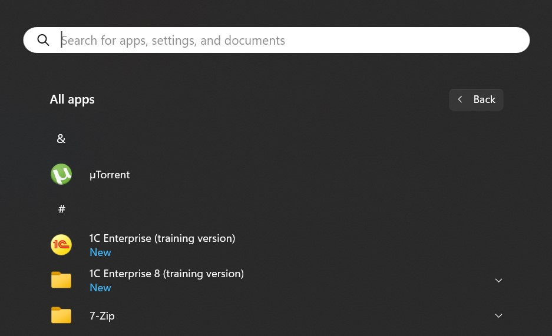

# Ответы на задание homework-1 

### Задание

1. По ссылке [online.1c.ru](http://online.1c.ru/catalog/free/learning.php) скачайте дистрибутив
2. Установите платформу 1С, следуя алгоритму из лекции
3. Создайте свою первую базу данных
4. Выгрузите конфигурацию и базу данных  

### Решение  

1. Дистрибутив учебной версии успешно получени и скачан.
2. Платформа установлена.

  

3. Файловая база данных создана в каталоге *c:\1c_bases*  
4. Конфигурация и база данных выгружены и доступны по [ссылке](assets/) 
